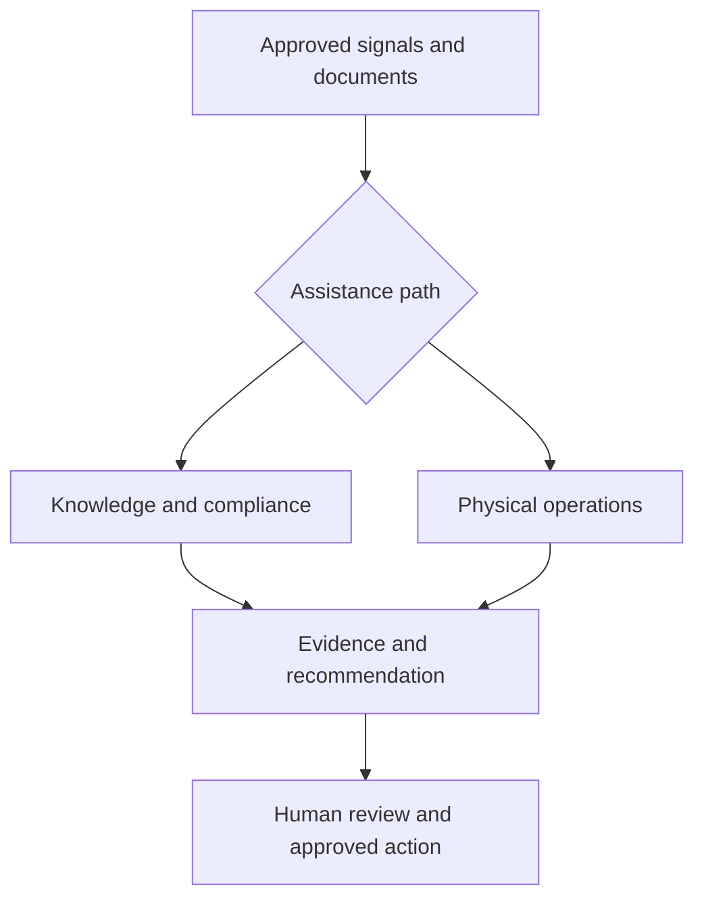

# Ops AI Library

**Manager-ready AI patterns for safer, faster operations work.**

This repository brings together copy-ready Gemini workflows, reusable agent instructions, governance controls, training material, and a reviewed incubator for operational AI concepts.

> **Prototype portfolio - not an official FedEx product or policy.** Use only approved enterprise tools and approved data. AI drafts and recommendations require human review. Never commit or paste customer, package, employee, route, security, credential, or facility-sensitive data into public or unapproved systems.

[Launch today's one-shot demo](demos/google-ai-studio-master-prompt.md) · [Open the offline hub](index.html) · [Browse 45 prompts](prompts/explorer.html) · [Review the concept portfolio](concepts/README.md)

---

## What is ready today

| Track | Artifact | Status | Manager value |
| --- | --- | --- | --- |
| Adopt | [Prompt Explorer](prompts/explorer.html) | Ready for approved use | Find, fill, and copy a guarded prompt in minutes |
| Adopt | [Gemini agent souls](souls/README.md) | Ready to configure | Reusable behavior for briefs, meetings, metrics, process improvement, and governance |
| Enable | [SharePoint / Teams page](sharepoint/ops-ai-library-page-template.html) | Template ready | Gives a team a simple front door without GitHub fluency |
| Govern | [Safe-use rules](governance/safe-use-rules.md) and [review checklist](governance/project-review-checklist.md) | Active guardrails | Keeps data handling and human accountability explicit |
| Incubate | [Operational AI concepts](concepts/README.md) | Concept / validation | Converts team ideas into testable, reviewable proposals |
| Prepare | [Gemini Enterprise story kit](docs/gemini-enterprise-story-prep.md) | Interview draft | Packages the workflow, technique, evidence plan, and replicable takeaway |
| Demonstrate | [Google AI Studio one-shot prompt](demos/google-ai-studio-master-prompt.md) | Synthetic build specification | Generates one coherent, source-aware control-tower demo |
| Trace | [SharePoint contribution register](docs/sharepoint-contribution-register-2026-09-03.md) | Current as of 2026-09-03 | Shows what is integrated, pending, or intentionally not copied |

## Start in 60 seconds

1. Open [Prompt Explorer](prompts/explorer.html).
2. Choose a first-week prompt such as **P01 Daily Manager Brief** or **P20 Metrics Summary**.
3. Replace placeholders with approved, scrubbed facts or safe aggregates.
4. Paste into Gemini Enterprise, review every claim against the source, and edit before sharing or acting.

For a team launch, use the [SharePoint native-page recipe](sharepoint/sharepoint-native-page-recipe.md), [15-minute workshop](docs/workshop-15-min.md), and [first-week print pack](docs/print-pack-first-week.md).

---

## Operational AI concept portfolio

Travis Long's August–September 2026 proposals are organized as a governed concept portfolio instead of loose documents or live-looking scripts.

| Concept | Role in the portfolio | Current gate |
| --- | --- | --- |
| [Zero-Click Compliance Agent](concepts/zero-click-compliance/README.md) | Retrieves approved compliance facts, grounds the required response in policy, and prepares drafts for review | Synthetic demo only; identity, data-owner, legal, and platform approval required |
| [Virtual Ride-Along Agent](concepts/virtual-ride-along-agent.md) | Translates route-condition telemetry into an evidence package for human review | Sensor calibration, privacy, consent, device, map-license, and FLME-owner validation required |
| [EAVA](concepts/eava.md) | Produces privacy-minimized flow and jam-risk metadata from approved camera feeds | Camera authority, edge benchmark, model validation, cybersecurity, and safety review required |
| [ACT](concepts/act.md) | Combines operational signals into ranked interventions and an auditable manager action plan | Advisory-only pilot before any hardware or labor action integration |
| [Smith Agent](concepts/smith-agent.md) | Provides the Analyst → Planner → Operator → Auditor orchestration and audit loop | Concept pattern; tool permissions, retry behavior, proof, and owners require validation |

The concepts share one operating principle: **sense or retrieve facts, reason within explicit constraints, then prepare the smallest reversible action for a human decision.**



See the [integrated architecture](concepts/integrated-operations-architecture.md) for boundaries, event flow, and shared controls.

---

## Library map

| Need | Go to |
| --- | --- |
| Use a prompt | [Prompt catalog](prompts/CATALOG.md) · [Prompt Explorer](prompts/explorer.html) |
| Build a Gemini agent | [Agent souls](souls/README.md) · [setup checklist](gemini-agents/agent-setup-checklist.md) |
| Launch with managers | [Getting started](docs/getting-started-for-managers.md) · [FAQ](docs/faq.md) · [workshop](docs/workshop-15-min.md) |
| Put it in Teams / SharePoint | [Page template](sharepoint/ops-ai-library-page-template.html) · [native recipe](sharepoint/sharepoint-native-page-recipe.md) |
| Review risk and data use | [Safe-use rules](governance/safe-use-rules.md) · [data cards](governance/data-cards.md) · [human in the loop](governance/human-in-the-loop.md) |
| Review a new idea | [Concept portfolio](concepts/README.md) · [project review checklist](governance/project-review-checklist.md) |
| Plan the cloud path | [GCP sandbox](playbooks/gcp-sandbox.md) · [Gemini Enterprise day one](playbooks/gemini-enterprise-day-one.md) |
| Build the synthetic control-tower demo | [One-shot master prompt](demos/google-ai-studio-master-prompt.md) · [synthetic-data standard](demos/synthetic-data-standard.md) |
| Run this week's meeting | [September 3 meeting brief](docs/weekly-meeting-2026-09-03.md) |
| Audit source coverage | [SharePoint contribution register](docs/sharepoint-contribution-register-2026-09-03.md) |

## Portfolio boundaries

This repository is the **manager enablement and concept-incubation layer**. It can hold prompts, training, governance, architecture proposals, synthetic proof-of-concept artifacts, and links to canonical applications. It is not the production runtime for every application.

- Production code, secrets, runtime identities, and operational data stay in approved, product-specific environments.
- Concepts do not become pilot-ready because they have a diagram or demo.
- Synthetic demonstrations must be labeled and must never imitate live success.
- Every promotion requires a named owner, approved data path, evaluation plan, rollback path, and human decision point.

Read the complete [product portfolio boundaries](docs/product-portfolio-boundaries.md).

## Safety and evidence standard

1. **Source before summary.** Every factual claim must trace to an approved source.
2. **Facts before causes.** Correlation, forecast, or anomaly does not prove root cause.
3. **Draft before action.** The default agency level is draft or recommend.
4. **Least data.** Prefer synthetic examples, aggregates, categories, and short retention.
5. **Smallest safe pilot.** Validate one workflow, one owner, one environment, and one success metric before scaling.
6. **No invented ROI.** Label targets, modeled estimates, and measured results separately.

## Maintainer checks

```bash
node scripts/build-prompt-index.mjs
node scripts/check-docs.mjs
python3 -m unittest discover -s concepts/zero-click-compliance/prototype/tests -v
```

## Contributing

Start with [CONTRIBUTING.md](CONTRIBUTING.md) and [AGENTS.md](AGENTS.md). New concepts must use the intake and validation gates in [concepts/README.md](concepts/README.md). Report sensitive material privately as described in [SECURITY.md](SECURITY.md).

## Attribution

- **Ops AI Library and integrated enablement program:** AI Efficiency Group contributors
- **Zero-Click Compliance Agent, Virtual Ride-Along Agent, EAVA, ACT, and Smith Agent concepts:** Travis Long
- **Repository integration and demo synthesis:** Ari Spector and AI Efficiency Group contributors
- **Human review and final operational accountability:** the authorized business owner for each use case
