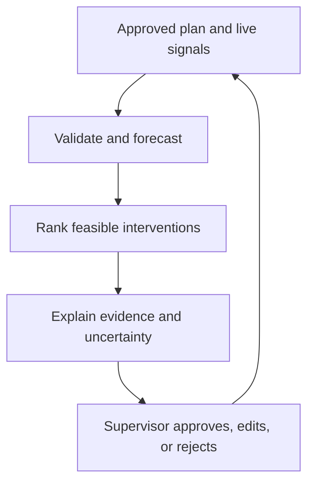

# AI-Enabled Coordination Tool (ACT)

**Status:** Concept

**Author:** Travis Long

**Date:** 2026-08

## Problem

Supervisors often assemble staffing, volume, flow, equipment, and timing information manually while the sort is already moving. ACT proposes a centralized advisory layer that forecasts the near-term operating state and ranks the smallest reversible intervention for an authorized supervisor.

ACT is the reasoning and coordination layer; EAVA is one possible signal source. ACT must remain useful when EAVA is unavailable.

## Decision loop

## Core engines

| Engine | Inputs | Deterministic output |
| --- | --- | --- |
| Pre-sort calibration | Approved plan, present headcount by role/zone, remaining volume range, target window | Revised assumptions, required throughput, infeasibility warnings |
| TLH trajectory | Elapsed time, validated work hours, processed volume, remaining estimate | Projected completion window and TLH range |
| Bottleneck forecast | EAVA or approved flow signals, belt state, queue estimates | Risk by zone and horizon |
| Intervention planner | Feasible actions, safety constraints, labor qualifications, local rules | Ranked options with reason codes and stop conditions |
| Root-cause capture | End-of-sort exception prompt | Structured, human-confirmed attribution record |

## Calculation contract

Keep calculations outside the language model and expose the assumptions. A basic planning quantity is:

\[
\text{required PPH per available handler} =
\frac{\text{remaining package estimate}}
{\text{available qualified handlers} \times \text{remaining hours}}
\]

This is a planning ratio, not a staffing instruction. The engine must handle ranges, missing data, zero/negative durations, qualifications, breaks, safety limits, facility constraints, and infeasible plans.

Projected TLH, completion time, and recommended actions must include a model/version identifier and reason codes. A language model may explain these outputs but may not silently alter them.

## Escalation ladder

| Level | Candidate response | Default authority |
| --- | --- | --- |
| 0 | Observe and explain | System |
| 1 | Recommend a manual flow or pacing check | Supervisor decides |
| 2 | Recommend a labor move between zones | Supervisor verifies qualifications and decides |
| 3 | Prepare a hardware-control request | Controls-authorized human reviews |
| 4 | Execute an approved reversible control action | Out of concept scope until separately approved |

The source proposal's VFD micro-pause and digital metronome ideas remain optional hypotheses. They are not bundled production features and require separate controls, safety, ergonomic, labor, and human-factors review.

## Unrecoverable-sort capture

When constraints make the target infeasible, ACT should stop optimizing toward a false promise. It may prompt the supervisor to select and annotate a cause category such as late inbound arrival, staffing loss, mechanical failure, high trainee density, or power/IT outage. The system records the manager's attribution as a human-entered claim and keeps it separate from measured telemetry.

## Required safeguards

- Advisory mode first; shadow decisions before influencing them.
- Hard safety and qualification constraints cannot be traded against productivity objectives.
- No individual-level productivity scoring or punitive employment use.
- A clear fallback when data, models, or network connectivity fail.
- Alert-rate limits, acknowledgement tracking, and fatigue monitoring.
- Separate controllable/uncontrollable classification from performance judgment.
- Audit trail for input versions, forecast, options, user choice, and outcome.

## Evaluation plan

Compare ACT with the current process over matched shifts. Report completion-time error, TLH projection error, alert precision, lead time, supervisor acceptance/edit/rejection rate, safety outcomes, service outcomes, and any adverse effects. A modeled 3-5% TLH reduction is a target hypothesis from the proposal, not a measured result.
