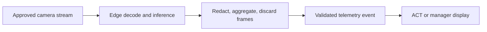

# Edge-AI Vision Algorithm (EAVA)

**Status:** Concept

**Author:** Travis Long

**Date:** 2026-08

## Problem

Barcode scans and photo eyes describe discrete events but can miss the physical shape of flow: belt occupancy, gaps, orientation, bridging, irregular items, and pre-jam conditions. EAVA proposes an approved edge-vision service that converts camera frames into short-lived, structured telemetry.

## Design principles

- **Process at the edge.** Raw video remains inside the approved facility boundary.
- **Discard by default.** Frames are analyzed in memory and not retained unless a separately approved incident workflow requires it.
- **Publish metadata, not footage.** Downstream systems receive validated events rather than video streams.
- **Fail open for operations.** Loss of EAVA must not stop normal belt operation or bypass existing safety systems.
- **No worker identification.** The concept is for package-flow conditions, not facial recognition, attendance, discipline, or individual productivity.

## Proposed pipeline



## Detection candidates

| Capability | Output | Validation question |
| --- | --- | --- |
| Surface occupancy | Belt area occupied by detected items | Does it match labeled frame measurements across lighting and belt types? |
| Flow rate | Objects crossing a calibrated line per minute | How does it reconcile with an independent count? |
| Orientation | Long-axis angle relative to belt direction | Which angles and object classes predict actual downstream risk? |
| Bridging | Multi-object configuration risk | What false-alert rate is tolerable before operators ignore alerts? |
| Irregular item | Approved class and confidence | Which classes have an operational response and enough labeled data? |
| Jam risk | Calibrated probability within a time horizon | Does it beat a simple occupancy/flow baseline on unseen shifts? |

## Example event contract

```json
{
  "schema_version": "1.0",
  "event_time": "2026-08-27T12:00:00Z",
  "source_id": "synthetic-camera-01",
  "zone_id": "synthetic-zone-a",
  "data_classification": "synthetic",
  "flow": {
    "belt_speed_fpm": 0.0,
    "occupancy_percent": 0.0,
    "flow_rate_ppm": 0
  },
  "risk": {
    "jam_probability": 0.0,
    "horizon_seconds": 0,
    "calibration_version": "not-calibrated"
  },
  "observations": {
    "sideways_package_count": 0,
    "bridging_detected": false,
    "irregular_items": []
  },
  "health": {
    "stream_ok": true,
    "model_ok": true,
    "dropped_frame_percent": 0.0
  }
}
```

All identifiers and numbers above are synthetic placeholders.

## Hardware strategy - validate before procurement

The proposal considers reuse of approved existing IP camera streams and station pilots on NVIDIA Jetson hardware. Capacity and cost claims must be benchmarked with the actual codec, resolution, frame rate, model precision, thermal envelope, enclosure, number of streams, and failure-recovery requirement. "Zero CAPEX" should be treated as a hypothesis: software integration, networking, cybersecurity, maintenance, labeling, and support still carry cost.

## Safety and control boundary

EAVA is advisory telemetry. It must never replace emergency stops, guards, light curtains, lockout/tagout procedures, or existing certified control logic. Any connection to a Variable Frequency Drive requires a separate controls-engineering hazard analysis, fail-safe design, manual override, change management, and written authorization.

## Evaluation plan

1. Record a separately approved, limited validation set or use a controlled synthetic simulator.
2. Label occupancy, flow, orientation, irregular items, bridge events, and actual jams.
3. Freeze train/validation/test splits by shift and camera to avoid leakage.
4. Compare the model with simple baselines.
5. Report precision, recall, false alerts per hour, lead time, calibration, drift, and system availability.
6. Shadow operators before any action recommendation.

No throughput, downtime, bandwidth, or ROI number is a measured result until the pilot records its baseline and evaluation method.
