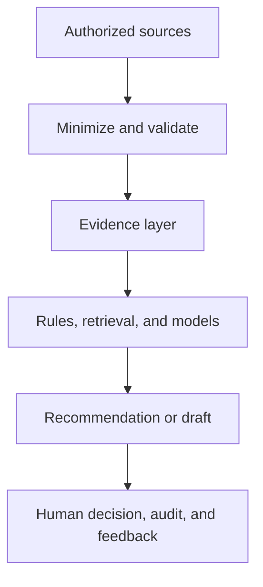

# Integrated Operations Architecture

## Purpose

The four Travis Long concepts cover two complementary operating loops:

- **Knowledge work:** Zero-Click Compliance retrieves an authorized fact set, grounds the response in approved policy, and prepares communications for review.
- **Physical operations:** the Virtual Ride-Along Agent and EAVA produce evidence signals; ACT turns approved signals into ranked, reversible recommendations.

They share controls but do not share unrestricted data stores or identities.



## Logical layers

| Layer | Responsibilities | Example outputs |
| --- | --- | --- |
| Source | Approved documents, enterprise records, device sensors, or camera streams | Raw input available only inside its approved boundary |
| Edge / connector | Authenticate, filter, redact, aggregate, discard unnecessary raw data | Minimal event or authorized record |
| Evidence | Validate schema, timestamp, source, confidence, and lineage | Versioned evidence object |
| Intelligence | Deterministic rules first; retrieval or models where justified | Policy citation, anomaly, forecast, ranked option |
| Interaction | Explain evidence, uncertainty, constraints, and next action | Manager brief, dossier, draft email, alert |
| Control | Require review, record disposition, monitor drift, support rollback | Approve, edit, reject, or escalate |

## Shared event envelope

Concept-specific payloads should fit a common envelope so evidence can be audited without forcing systems into one database.

```json
{
  "schema_version": "1.0",
  "event_id": "synthetic-event-001",
  "event_time": "2026-08-27T12:00:00Z",
  "source_type": "synthetic",
  "source_id": "demo-source-a",
  "purpose": "controlled-evaluation",
  "data_classification": "synthetic",
  "payload": {},
  "quality": {
    "confidence": 0.0,
    "missing_fields": [],
    "calibration_version": "not-calibrated"
  },
  "lineage": {
    "producer_version": "concept",
    "retention_class": "ephemeral"
  }
}
```

Real identifiers, credentials, route traces, employee records, and facility details must not be placed in public examples.

## Action ladder

| Level | System behavior | Approval expectation |
| --- | --- | --- |
| 0 - Observe | Collect a validated, minimum-necessary signal | Approved data path |
| 1 - Explain | Display evidence and uncertainty | User interprets |
| 2 - Recommend | Rank reversible options | Authorized manager chooses |
| 3 - Prepare | Draft a message, dossier, or control request | Human reviews and submits |
| 4 - Execute with approval | Perform an approved, reversible action | Explicit confirmation plus logging |
| 5 - Autonomous control | Execute without contemporaneous approval | Out of scope until separately approved |

The portfolio defaults to Levels 1-3. Hardware control, labor direction, HR action, contract settlement, and external communication require separate authorization.

## Platform direction

- Use **Gemini Enterprise / Agent Search** data stores only after data-owner approval, access-control testing, and retrieval evaluation.
- Deploy custom tools as narrowly scoped services with separate identities and least-privilege permissions.
- Prefer APIs and approved exports over browser automation. Authenticated browser automation remains a controlled fallback, not the default architecture.
- Keep deterministic calculations outside the language model. The model may explain results but should not silently invent thresholds or recompute official metrics.
- Preserve citations, source versions, prompt/model versions, and reviewer disposition in the audit trail.

## Cross-concept sequence

1. EAVA or the Virtual Ride-Along Agent emits a minimized evidence event.
2. A deterministic validator rejects stale, malformed, uncalibrated, or unauthorized input.
3. ACT may combine accepted events with an approved operational plan and produce ranked recommendations.
4. The user receives the evidence, confidence, operational constraint, and smallest safe next action.
5. The authorized user approves, edits, rejects, or escalates; the disposition becomes evaluation feedback, not automatic model training.

Zero-Click Compliance follows the same sequence with authorized records and policy documents instead of physical telemetry.
