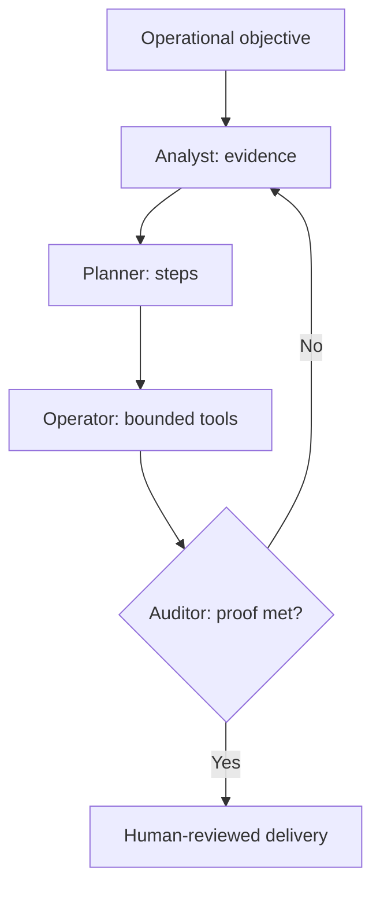

# Smith Agent Baseline

**Modular multi-agent framework and governed execution loop**

| Field | Value |
| --- | --- |
| Author / initiator | Travis Long |
| Source version | 1.0 |
| Source audience | NWST Region AI Team draft |
| Repository status | Concept; orchestration pattern demonstrated, not production-approved |
| Human decision | Whether an operational workflow is qualified, sufficiently specified, and safe to advance |

## Executive summary

Smith Agent is a reusable orchestration pattern for converting narrow, recurring operational problems into reviewable agent workflows. A central orchestrator moves work through four roles—Analyst, Planner, Operator, and Auditor—and loops rejected work back for refinement.

It is a design pattern, not blanket authority for autonomous action. Production use requires approved data paths, explicit tool permissions, owners, evaluation, monitoring, rollback, and governance review.

## The four-worker loop

| Worker | Responsibility | Typical output |
| --- | --- | --- |
| Analyst | Ingest approved inputs, establish ground truth, identify anomalies, and separate facts from assumptions | Evidence summary with provenance and uncertainty |
| Planner | Turn the goal into ordered, dependency-aware steps with fallbacks and stop conditions | Reviewable execution plan |
| Operator | Execute only allow-listed tools at the approved agency level | Tool receipts, drafts, or proposed actions |
| Auditor | Test the result against proof criteria, policy, schema, and data boundaries | Approve, reject with reasons, or escalate |

## Qualification: ARR

Use Smith Agent only when all three conditions are present:

- **Autonomous:** the workflow can progress through defined steps without a person steering every micro-step.
- **Recurring:** the task happens on a schedule or predictable trigger.
- **Reviewable:** the result leaves evidence a responsible owner can inspect.

If the task is one-off, relies on live physical judgment, or cannot produce auditable proof, use an ad-hoc assistant or human process instead.

## Specification: GPS

Every candidate must define:

- **Goal:** one unambiguous outcome.
- **Proof:** the evidence and acceptance criteria that demonstrate success.
- **Steps:** the ordered workflow, dependencies, tools, fallbacks, and stop conditions.

Example:

> At the scheduled handoff, parse approved synthetic exception inputs, compare them with the plan, calculate impact ranges, produce a source-linked briefing, and stage it for supervisor review.

## OODA adaptation

The loop uses an Observe–Orient–Decide–Act cycle:

1. Observe the current response, operational state, and errors.
2. Orient against approved rules, baselines, and constraints.
3. Decide whether to proceed, retry, branch, stop, or escalate.
4. Act through an allow-listed tool and capture the result.

Retry limits are mandatory. Exhausted retries must end in an explicit escalation—not silent approval.

## Agency ladder

| Level | Allowed behavior | Default for this repository |
| --- | --- | --- |
| 0 | Read and explain | Allowed with approved or synthetic inputs |
| 1 | Recommend | Allowed; label assumptions and confidence |
| 2 | Draft or stage | Allowed in a controlled demo; human approval required |
| 3 | Execute reversible action | Requires written tool-level approval and monitoring |
| 4 | Execute consequential action | Out of scope for public prototypes |

The Operator must never report a simulated tool call as a real action.

## Candidate applications

- Shift handoff and sort-performance recap.
- Incident and system-log triage.
- First/last-mile road-condition evidence preparation.
- Compliance fact retrieval and draft preparation.
- EAVA/ACT operational signal review.

These are opportunities, not claims of deployed capability.

## Staged validation

1. **Shadow:** compare outputs with the current human process without affecting operations.
2. **Assist:** generate source-linked drafts and alerts for explicit human approval.
3. **Bounded execution:** consider only after measured performance, formal approvals, monitoring, rollback, and incident ownership exist.

The source proposal described an autonomous third phase. This repository narrows that phase: consequential actions, employee decisions, hardware control, customer communication, and policy determinations remain human-authorized.

## Workflow intake

| Field | Required content |
| --- | --- |
| Initiative | Short, neutral name |
| Problem | Current process, frequency, friction, and estimated effort—clearly labeled if estimated |
| ARR | Autonomous, Recurring, Reviewable: yes/no with evidence |
| Goal | One sentence |
| Proof | Acceptance tests, sources, and reviewer |
| Steps | Inputs → analysis → proposed/draft output → audit → human decision |
| Data | Approved sources, classification, minimum fields, retention, and prohibited fields |
| Tools | Allow list, permissions, rate limits, timeouts, and rollback |
| Failure | Stop conditions, retry ceiling, escalation owner |
| Evaluation | Baseline, quality metric, safety metric, and test window |

## Open validation questions

- Which source systems and data owners approve each input?
- What exact proof threshold is required for each use case?
- Which actions are draft-only and which, if any, may become reversible executions?
- How are prompt, model, policy, and tool versions recorded for audit?
- What false-positive, false-negative, latency, and escalation rates are acceptable?
- Which HR, privacy, labor, legal, safety, cybersecurity, and records reviews apply?

## Attribution and source handling

This document normalizes Travis Long's SharePoint draft into the repository's concept template. It preserves ARR, GPS, OODA, the four-worker loop, the candidate applications, and staged validation while adding explicit agency limits, retry failure behavior, evidence provenance, and promotion gates.
